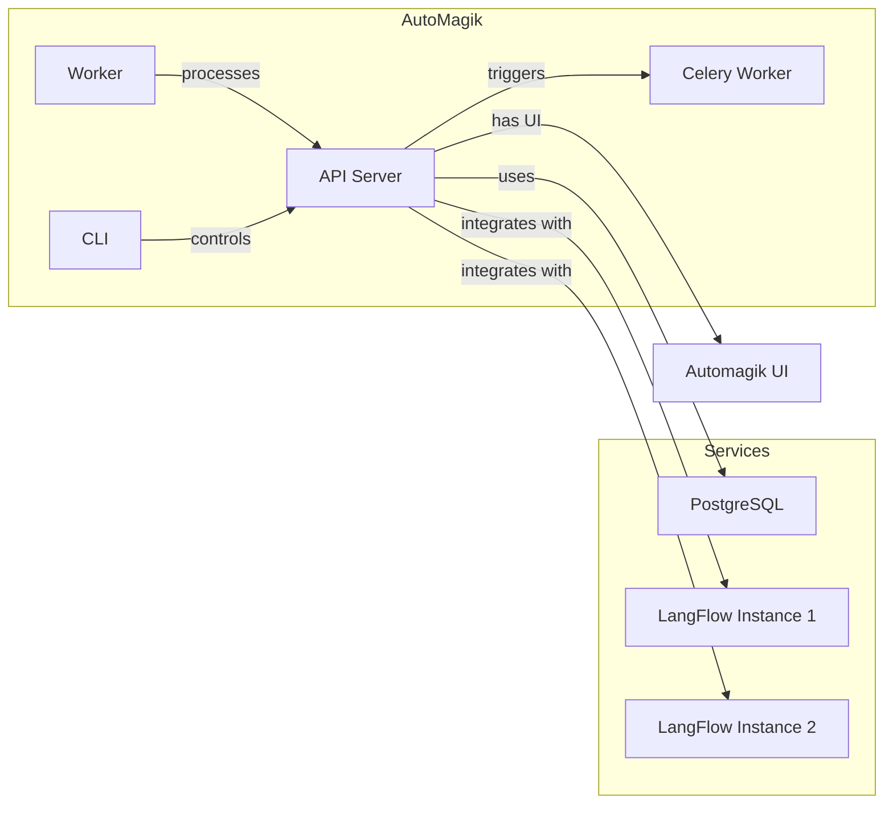

<p align="center">
  
</p>

# AutoMagik

> **Because magic shouldn't be complicated.**

AutoMagik is an agent-first automation engine that transforms how you manage AI workflows. It seamlessly integrates with multiple [LangFlow](https://github.com/langflow-ai/langflow) instances, allowing you to deploy AI-driven processes with unprecedented ease.

## ✨ Key Features

- **Multi-Instance Integration**: Connect seamlessly with multiple LangFlow instances
- **Flexible Scheduling**: Set up one-time or recurring automated tasks
- **Zero-Code Solution**: Deploy production-grade AI automation without writing a single line of code
- **Comprehensive Monitoring**: Track performance and execution of all your AI workflows
- **Integrated Ecosystem**: Part of a complete suite with [AutoMagik Agents](https://github.com/namastexlabs/automagik-agents) and [AutoMagik UI](https://github.com/namastexlabs/automagik-ui)

## 🚀 Getting Started

### Prerequisites

- Linux-based system (Ubuntu/Debian recommended)
- Docker and Docker Compose (automatically installed on Ubuntu/Debian if not present)

### Installation Options

#### Production-Ready Setup
```bash
./scripts/setup_local.sh
```

#### Development Environment
```bash
./scripts/setup_dev.sh
```

### What Happens During Setup

Both setup scripts will:
- Generate necessary environment configurations
- Install Docker if needed (Ubuntu/Debian)
- Configure and launch all required services
- Install the CLI tool (optional)
- Guide you through each step with clear instructions

### After Installation

You'll have access to:
- **AutoMagik API**: Running at [http://localhost:8888](http://localhost:8888)
- **PostgreSQL Database**: Available at `localhost:15432`
- **Worker Service**: Ready to process tasks and schedules
- **CLI Tool**: Installed if chosen during setup

### Verifying Your Installation

The setup automatically verifies all services, but you can also check manually:

```bash
# Access comprehensive API documentation
open http://localhost:8888/api/v1/docs  # Interactive Swagger UI
open http://localhost:8888/api/v1/redoc # ReDoc documentation

# List flows (requires CLI installation)
source .venv/bin/activate
automagik flow list
```

## 🧩 System Architecture

AutoMagik consists of several integrated components:



### Core Components

- **API Server**: Handles HTTP requests and orchestrates the system's core logic
- **Worker**: Processes scheduled and on-demand tasks
- **Database**: PostgreSQL instance storing flows, tasks, schedules, and system data
- **LangFlow**: Optional visual editor for creating AI workflows
- **CLI Tool**: Command-line interface for efficient system management

## 🛠️ Next Steps

1. Create your first flow in LangFlow at [http://localhost:17860](http://localhost:17860)
2. Explore the API through the interactive documentation at [http://localhost:8888/api/v1/docs](http://localhost:8888/api/v1/docs)
3. Master the CLI with `automagik --help`
4. Monitor your tasks through the logs and API endpoints

---

# AutoMagik Agents

A sophisticated toolkit for rapidly building and deploying production-ready AI agents using the Pydantic AI framework. Create custom agents from pre-built templates, expose them through a robust RESTful API, and manage conversations with integrated memory and specialized tools.

## 🌟 Features

### Extensible Agent System
- **Template-Driven Development**: Create new agents from battle-tested templates
- **Pre-Built Options**: Start with Simple Agent or Notion Agent templates
- **Intuitive CLI**: Generate new agents with simple commands
- **Automatic Tool Management**: Register and manage tools with minimal configuration

### Enterprise-Grade API
- **FastAPI Backend**: Benefit from high-performance async REST endpoints
- **Sophisticated Session Management**: Track conversation history across interactions
- **Structured Data Models**: Clear request/response patterns with Pydantic
- **Security First**: Built-in authentication and CORS protection
- **Reliability Focus**: Health monitoring and version tracking included

### Advanced Memory System
- **Persistent History**: Maintain conversation context between sessions
- **Efficient Data Management**: Session-based memory organization
- **Tool Interaction Tracking**: Record all tool calls and outputs
- **Structured Storage**: Organized message repositories

### Ready-to-Use Templates
- **Simple Agent**: Quick-start template with chat functionality and datetime tools
- **Notion Agent**: Complete Notion integration with database management capabilities

## 🚀 Quick Start

### Installation
```bash
pip install automagik-agents
```

### Environment Configuration
```bash
# Copy the example environment file
cp .env-example .env

# Configure essential variables
AM_API_KEY=your_api_key_here
AM_HOST=0.0.0.0
AM_PORT=8000
OPENAI_API_KEY=your_openai_key_here
OPENAI_MODEL=openai:gpt-4o-mini  # or your preferred model

# For Notion agent (optional)
NOTION_TOKEN=your_notion_integration_token
```

### Creating Your First Agent
```bash
# Create from simple template
automagik-agents create-agent -n my_assistant -t simple_agent

# Create from Notion template
automagik-agents create-agent -n notion_assistant -t notion_agent
```

### Launching the API Server
```bash
automagik-agents api start --reload
```

## 💡 Usage Examples

### API Interaction

#### Health Check
```bash
curl http://localhost:8000/health
```

#### Running Agents

**Simple Agent**
```bash
curl -X POST http://localhost:8000/agent/simple_agent/run \
  -H "X-API-Key: your_api_key" \
  -H "Content-Type: application/json" \
  -d '{
    "message_input": "What time is it in Tokyo?",
    "session_id": "user123_session"
  }'
```

**Notion Agent**
```bash
curl -X POST http://localhost:8000/agent/notion_agent/run \
  -H "X-API-Key: your_api_key" \
  -H "Content-Type: application/json" \
  -d '{
    "message_input": "List all my databases and their properties",
    "session_id": "user123_notion_session"
  }'
```

#### Session Management

**Retrieve Session History**
```bash
curl http://localhost:8000/session/user123_session \
  -H "X-API-Key: your_api_key"
```

**Clear Session Data**
```bash
curl -X DELETE http://localhost:8000/session/user123_session \
  -H "X-API-Key: your_api_key"
```

### Building Custom Agents

#### 1. Create Agent from Template
```bash
automagik-agents create-agent -n knowledge_base -t simple_agent
```

#### 2. Customize Core Components
- Modify `src/agents/knowledge_base/prompts.py` to define system behavior
- Update `src/agents/knowledge_base/agent.py` to implement custom logic
- Configure `src/agents/knowledge_base/__init__.py` for agent settings

#### 3. Add Specialized Tools
```python
def register_tools(self):
    """Register custom tools with the agent."""
    # Built-in tool registration
    self.agent.tool(self.get_current_time)
    
    # Custom tool registration
    self.agent.tool(self.search_knowledge_base)
    
def search_knowledge_base(self, query: str) -> str:
    """Search the knowledge base for relevant information.
    
    Args:
        query: The search query
        
    Returns:
        Relevant information from the knowledge base
    """
    # Implementation goes here
    return f"Results for: {query}"
```

## 📄 License

This project is licensed under the MIT License - see the [LICENSE](LICENSE) file for details.

---

<p align="center">
  <b>AutoMagik: Bringing AI Automation to Life</b><br>
  <a href="https://github.com/namastexlabs/automagik">AutoMagik</a> |
  <a href="https://github.com/namastexlabs/automagik-agents">AutoMagik Agents</a> |
  <a href="https://github.com/namastexlabs/automagik-ui">AutoMagik UI</a>
</p>
