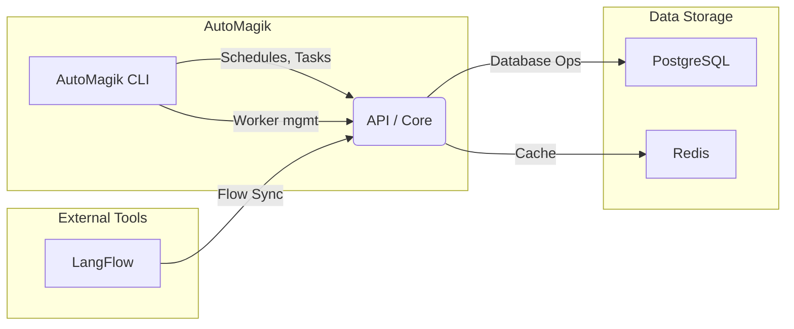

# AutoMagik

Because magic shouldn't be complicated.

AutoMagik is a workflow automation system that lets you run AI-driven flows from [LangFlow](https://github.com/logspace-ai/langflow) with minimal fuss. Deploy tasks, monitor them, and iterate quickly—without writing a bunch of code.

---

## Quick Setup (Docker)

The easiest way to get started with AutoMagik is using Docker Compose. This will automatically set up all required services including PostgreSQL, the API, worker, and LangFlow.

### Prerequisites

- Docker and Docker Compose installed
- Git (to clone the repository)

### One-Command Setup

1. Clone the repository:

   ```bash
   git clone https://github.com/namastexlabs/automagik.git
   cd automagik
   ```

2. Start all services:

   ```bash
   cd docker/
   docker-compose -p automagik up -d
   ```

3. Initialize the database (first time only):

   ```bash
   # Initialize database schema
   docker-compose exec automagik-api python -m automagik db init
   
   # Create and apply migrations
   docker-compose exec automagik-api python -m automagik db migrate 
   docker-compose exec automagik-api python -m automagik db upgrade
   ```

   For subsequent updates, only run:

   ```bash
   docker-compose exec automagik-api python -m automagik db upgrade
   ```

   Then restart the automagik worker:

   ```bash
   docker restart automagik-worker
   ```

That's it! Once the commands complete, you'll have:

- AutoMagik API running at <http://localhost:8000>
- LangFlow UI at <http://localhost:7860>
- PostgreSQL database running (automatically configured)
- Worker service running and ready to process tasks

### Verify Installation

Check that everything is working:

```bash
# Check API status
curl http://localhost:8000/api/v1/

# Access API documentation
open http://localhost:8000/api/v1/docs  # Interactive Swagger UI
open http://localhost:8000/api/v1/redoc # ReDoc documentation
```

### What's Included

- **API Server**: Handles all HTTP requests and core logic
- **Worker**: Processes tasks and schedules
- **Database**: PostgreSQL with all required tables automatically created
- **LangFlow**: Visual flow editor for creating AI workflows

### Next Steps

1. Visit <http://localhost:7860> to create your first flow in LangFlow
2. Use the API at <http://localhost:8000/api/v1/docs> to manage your flows and tasks
3. Monitor task execution and logs through the API

For advanced setup and configuration options, see the sections below.

---

## How to Use the API

After containers are up, you can run the AutoMagik API server. By default, the server listens on port 8000:

• Check API status:

  ```
  curl http://localhost:8000/api/v1/
  ```

• Explore interactive docs:

- Swagger UI: <http://localhost:8000/api/v1/docs>
- ReDoc: <http://localhost:8000/api/v1/redoc>

• Example endpoints:

- GET /api/v1/flows  
- POST /api/v1/tasks  
- GET /api/v1/schedules  

Secure your API with an API key: set AUTOMAGIK_API_KEY in your .env.

---

## Extra: CLI Setup

AutoMagik ships with a handy CLI tool. If you have Python ≥3.10:

1. Clone the repo and install locally:

   ```
   git clone https://github.com/namastexlabs/automagik.git
   cd automagik
   python -m venv .venv
   source .venv/bin/activate
   pip install -e .
   ```

2. Run CLI commands, for instance:

   ```
   automagik --help
   automagik flow list
   automagik schedules create ...
   automagik worker start
   ```

3. The CLI covers tasks like flow synchronization, scheduling, worker management, etc.

---

## Development Setup

For development, you'll want to set up AutoMagik locally:

1. Clone the repository:
   ```bash
   git clone https://github.com/namastexlabs/automagik.git
   cd automagik
   ```

2. Run the setup script:
   ```bash
   ./scripts/setup.sh
   ```
   This will:
   - Create a virtual environment
   - Install dependencies
   - Set up git hooks for code quality
   - Configure the development environment

### Git Hooks

The project uses git hooks to ensure code quality:

- **pre-push**: Runs tests and checks test coverage before allowing pushes
  - Ensures all tests pass
  - Verifies test coverage is above 45%
  - Prevents pushing if checks fail

These hooks are automatically configured when you run `setup.sh`. If you need to reconfigure them manually:
```bash
git config core.hooksPath .githooks
chmod +x .githooks/pre-push scripts/run_tests.sh
```

---

## Project Structure

Here’s a simplified view of how the pieces connect:



- “API / Core” (FastAPI) handles all HTTP requests and internal logic.  
- “AutoMagik CLI” interacts with the core for tasks & scheduling.  
- PostgreSQL stores flows, tasks, schedules, etc.  
- Redis is used by workers for caching.  
- LangFlow flows can be synced in or out.

---

## Development

1. Fork/clone this repository.  
2. Create a virtual environment and install with dev dependencies:

   ```
   pip install -e ".[dev]"
   ```

3. Run tests:

   ```
   pytest
   ```

4. Make changes, commit, and open a pull request or push to your fork.

See more details in [our docs](docs/README.md) or the main [README.md](README.md).

---

Enjoy your magical AI workflows!  
If you have questions or issues, check out our [docs](docs/README.md) and open an issue if needed.
