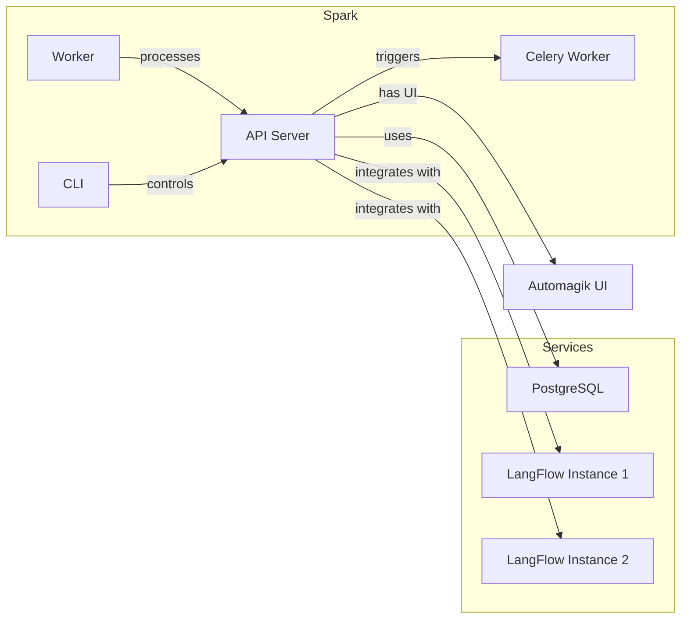

<p align="center">
  
</p>

# Spark

> **Because magic shouldn't be complicated. **

Spark is an automagion engine that seamlessly integrates with multiple [LangFlow](https://github.com/langflow-ai/langflow) instances. Deploy AI-driven flows, schedule one-time or recurring tasks, and monitor everything with minimal fuss—no coding required.

## 🔗 Ecosystem

- **[AutoMagik Agents](https://github.com/namastexlabs/automagik-agents)**: Develop production-level AI agents
- **[AutoMagik UI](https://github.com/namastexlabs/automagik-ui)**: Create agents using natural language with our dedicated UI

## 🚀 Installation

Spark provides two setup options:

### Prerequisites

- Linux-based system (Ubuntu/Debian recommended)
- Docker and Docker Compose (automatically installed on Ubuntu/Debian if not present)

### Local Production Setup

For a production-ready local environment:

```bash
./scripts/setup_local.sh
```

### Development Setup

For development with PostgreSQL and Redis Docker containers:

```bash
./scripts/setup_dev.sh
```

### What Happens During Setup

Both setup scripts will:
- Create necessary environment files
- Install Docker if needed (on Ubuntu/Debian)
- Set up all required services
- Install the CLI tool (optional)
- Guide you through the entire process

### After Installation

You'll have access to:
- **Spark API**: Running at [http://localhost:8883](http://localhost:8883)
- **PostgreSQL Database**: Available at `localhost:15432`
- **Worker Service**: Running and ready to process tasks
- **CLI Tool**: Installed (if chosen during setup)

### Verifying Your Installation

The setup automatically verifies all services, but you can also check manually:

```bash
# Access API documentation
open http://localhost:8883/api/v1/docs  # Interactive Swagger UI
open http://localhost:8883/api/v1/redoc # ReDoc documentation

# List flows (requires CLI installation)
source .venv/bin/activate
automagik-spark flow list
```

## 🧩 System Components

- **API Server**: Handles all HTTP requests and core logic
- **Worker**: Processes tasks and schedules
- **Database**: PostgreSQL with all required tables automatically created
- **LangFlow** (optional): Visual flow editor for creating AI workflows
- **CLI Tool** (optional): Command-line interface for managing flows and tasks

## 🏗️ System Architecture



### Core Components Explained

- **API**: Core service handling requests and business logic
- **Worker**: Processes tasks and schedules
- **CLI**: Command-line tool for managing flows and tasks
- **PostgreSQL**: Stores flows, tasks, schedules, and other data
- **LangFlow**: Optional service for creating and editing flows

## 📚 API Documentation

For complete API documentation, visit:
- **Swagger UI**: [http://localhost:8883/api/v1/docs](http://localhost:8883/api/v1/docs)
- **ReDoc**: [http://localhost:8883/api/v1/redoc](http://localhost:8883/api/v1/redoc)

## 🛠️ Next Steps

1. If you installed LangFlow, visit [http://localhost:17860](http://localhost:17860) to create your first flow
2. Use the API at [http://localhost:8883/api/v1/docs](http://localhost:8883/api/v1/docs) to manage your flows and tasks
3. Try out the CLI commands with `automagik-spark --help`
4. Monitor task execution through logs and API endpoints

## 📊 Telemetry

Spark collects anonymous usage analytics to help improve the project. This data helps us understand which features are most useful and prioritize development efforts.

### What We Collect
- Command usage and performance metrics
- API endpoint usage patterns
- Workflow execution statistics
- System information (OS, Python version)
- Error rates and types

### What We DON'T Collect
- Personal information or credentials
- Actual workflow data or content
- File paths or environment variables
- Database connection strings or API keys

### How to Disable Telemetry

**Environment Variable:**
```bash
export AUTOMAGIK_SPARK_DISABLE_TELEMETRY=true
```

**CLI Commands:**
```bash
# Disable permanently
automagik-spark telemetry disable

# Check status
automagik-spark telemetry status

# See what data is collected
automagik-spark telemetry info

# Use --no-telemetry flag for single session
automagik-spark --no-telemetry <command>
```

**Opt-out File:**
```bash
touch ~/.automagik-no-telemetry
```

Telemetry is automatically disabled in CI/testing environments.

## 🗺️ Roadmap

Spark's future development focuses on:
- TBA

---

<p align="center">
  <b>Spark: Bringing AI Automation to Life</b>
</p>
